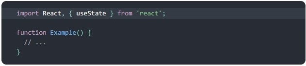

# Reack Hooks e Padrões (Teoria)

**O que é um Hook?** Um Hook é uma função especial que te permite utilizar recursos do React. Por exemplo, useState é um Hook que te permite adicionar o state do React a um componente de função.

## [useState()](https://pt-br.reactjs.org/docs/hooks-state.html)

## Regras dos Hooks

[Regras](https://pt-br.reactjs.org/docs/hooks-rules.html)
